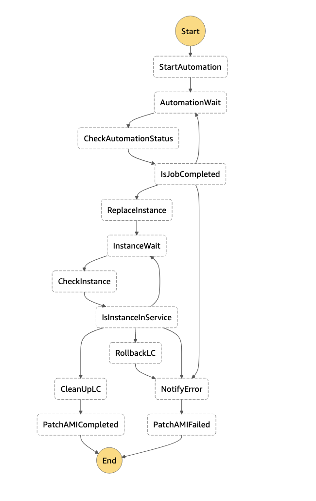

# Patch AMI and update LaunchConfiguration
## Overview
This template creates solution applies AWS-RunPatchBaseLine to a existing AMI and create a new AMI. Then update LaunchConfiguratio with the new AMI.


## Resources
- SSM Automation Document
- Lambda Functions
- CloudWatch Event Rule
- Step Functions
- Automation Service Role
- EC2 Role
- SNS Topic

## Deployment
```
aws cloudformation package --template-file patch_ami_statemachinereplace_eni.yaml --s3-bucket <S3 bucket name> --s3-prefix <S3 prefix name> -output-template-file package.yaml
aws cloudformation deploy --template-file package.yaml --stack-name <Stack Name> --capabilities CAPABILITY_NAMED_IAM  --parameter-overrides Tenancy=<Tenancy> Environment=<Environment> LogBucketName=<S3 bucket Name> AppSubnetId=<Subnet ID>

```

## Operation
### Start Statemachine lambda function is triggered by schedule.
- This function searches a tag in Autoscaling groups which has a key value pair **auto:patch=True**
- And start Step Functions for the group
### Step Functions

- Starts SSM Automation
- - This document starts a new EC2 instance with the given AMI
- - Apply AWS-RunPatchBaseLine to the instance
- - Stops the instance
- - Create AMI from the instance
- - Terminate the instance
- Replace Instance
- - update asg function to create a new LaunchConfiguration and update Autoscaling Group
- - Stop instance running for the Autoscaling Group
- Update LaunchConfig
- - Delete the old LaunchConfiguration when the new instance is InService status.
- - If the new instance does not become healthy in 10 minutes, rollback the Autoscaling Group with the old LaunchConfiguration
- If the step function fails, SNS is published